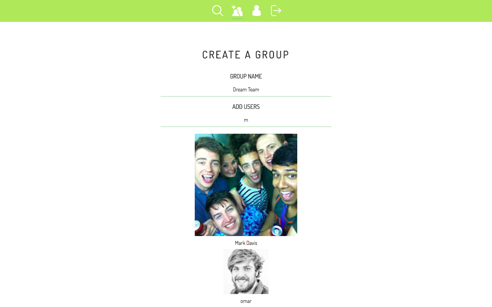
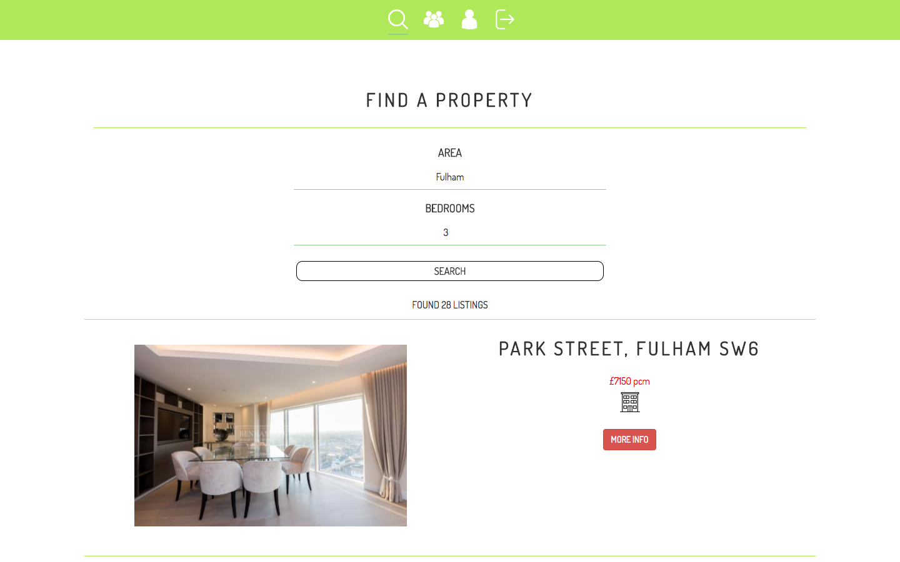

# GA WDI London: Project 3

## groupmove

Groupmove is a MEAN stack application that provides groups of people with the ability to find rental properties together, hopefully removing stress in the process! It was built by [Mark Davis](https://github.com/markjdvs), [Omar Harvey-Phillips](https://github.com/omaotzu) & [Raiden Dilan](https://github.com/RaidenDilan).

### User Journey

People looking to live in a house or flat share often encounter difficulties in attempting to coordinate all other potential house mates to attend a specific viewing. This app aims to create a platform where lack of full attendance doesn't hinder a group in finding and signing on a property to rent together.

Users must create or be a member of a group in order to store properties.

Once part of a group, any member can search for properties, using the [Zoopla API](https://developer.zoopla.co.uk/docs), and add those that appeal to their group.

These stored properties are displayed on the group's profile page.

")
")

Members who visit the properties can upload actual images from the viewing, rate and leave notes to create a more comprehensive snapshot of any properties.

Local crime and geographical data, dependent on the specific property, thereby allowing the group to make a more informed decision on where to live.

")
")

### Build & Technologies Used

- This app is built with an [Express](https://github.com/expressjs/express) back-end, written using Node.js, that serves an API that's consumed by our client-side [Angular](https://angularjs.org) app.

- [MongoDB](https://docs.mongodb.com) was used to store the data and [Mongoose](http://mongoosejs.com) to create models within express.

- Images are base64 encoded and stored using the [AWS S3 service](https://aws.amazon.com/s3).

- [JWT](https://jwt.io) is used with [Satellizer](https://github.com/sahat/satellizer) for authentication, [bcrypt](https://www.npmjs.com/package/bcrypt) for password hashing and oAuth authorisation via Facebook.

- [UI Router](https://github.com/angular-ui/ui-router) is our chosen single page application routing framework.

- [UI Bootstrap](https://github.com/angular-ui/bootstrap) is used to provide grid layouts and additional functionality including Modals.

- Styles are written in [SASS](http://sass-lang.com/documentation/file.SASS_REFERENCE.html) and [Gulp](https://github.com/gulpjs/gulp/blob/master/docs/API.md) is used as a taskrunner.

- We used [Babel](https://babeljs.io) to compile to ES5.

- [Zoopla](https://developer.zoopla.co.uk/docs) is used to search for properties to add to a group's profile page.

- The [Police API](https://data.police.uk/docs/) and [Google Maps](https://developers.google.com/maps/documentation/javascript/tutorial) were used to provide local crime and geographic data respectively on individual properties.

* The app is deployed via Heroku. [Try it here.](https://groupmove.herokuapp.com/)

### Challenges

The biggest blocker we encountered was populating each group with its members in order that each user could add properties to that particular group. In hindsight, this could have been prevented with some more extensive model planning. However, we found a solution using mongoDB's ability to populate virtuals. By referencing the about-to-be-created group for each user we connected these two models.
